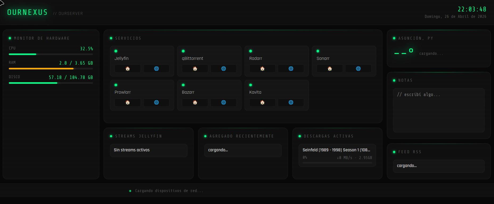

> 📖 [English version](README.md)

# OurNexus Dashboard

Dashboard personal para mi servidor doméstico, construido desde cero para monitorear y controlar mi infraestructura self-hosted. Accesible desde cualquier dispositivo vía Tailscale VPN.




## Funcionalidades

- **Monitor de Sistema** — CPU, RAM y disco en tiempo real con barras de progreso dinámicas y alertas de color
- **Descargas Activas** — Integración con qBittorrent mostrando torrents activos con barra de progreso y velocidades
- **Accesos Rápidos** — Links a todos los servicios self-hosted con acceso local y por Tailscale
- **Reloj** — Fecha y hora en tiempo real
- **Notas** — Bloc de notas persistente guardado localmente
- *Widgets en desarrollo: streams de Jellyfin, contenido reciente de Radarr/Sonarr, clima, RSS, dispositivos en red*

## Stack Técnico

| Capa | Tecnología | Por qué |
|------|-----------|---------|
| Backend | Python + FastAPI | Moderno, rápido, genera documentación de API automáticamente |
| Frontend | Vanilla HTML/CSS/JS | Sin frameworks — entiendo cada línea de código |
| Métricas del sistema | psutil | Librería Python nativa para datos del sistema operativo |
| Cliente de descargas | qBittorrent Web API | Integración REST |
| Acceso remoto | Tailscale | VPN sin configuración compleja, túnel seguro |
| Sistema operativo | Debian 13 | Estable, minimal, corre en hardware de bajo consumo |

## Arquitectura
Navegador (cualquier dispositivo)
│
▼
Backend FastAPI (puerto 8000)
├── /api/sistema     → psutil lee CPU/RAM/disco
├── /api/descargas   → proxy hacia qBittorrent Web API
└── /static/         → sirve los archivos del frontend
El backend actúa como proxy entre el frontend y los servicios internos. Así las credenciales y URLs de los servicios nunca quedan expuestas al navegador.

## Hardware del Servidor

Laptop reciclada funcionando 24/7 como servidor doméstico:
- **CPU:** Intel Celeron N4000
- **RAM:** 4GB
- **OS:** Debian 13 minimal
- **Acceso:** Red local + Tailscale VPN

## Servicios Self-hosted

Jellyfin · qBittorrent · Radarr · Sonarr · Prowlarr · Bazarr · Kavita

## Instalación

```bash
git clone https://github.com/e-fleitas/ournexus
cd ournexus
python3 -m venv venv
source venv/bin/activate
pip install -r requirements.txt
cp .env.example .env
# Editá .env con tus credenciales
uvicorn main:app --host 0.0.0.0 --port 8000
```

## Variables de Entorno

Ver `.env.example` para las variables requeridas.

---

*Construido como primer proyecto real de portfolio — aprendiendo FastAPI, JavaScript vanilla, administración de servidores Linux e integración de APIs construyendo algo que uso todos los días.*
