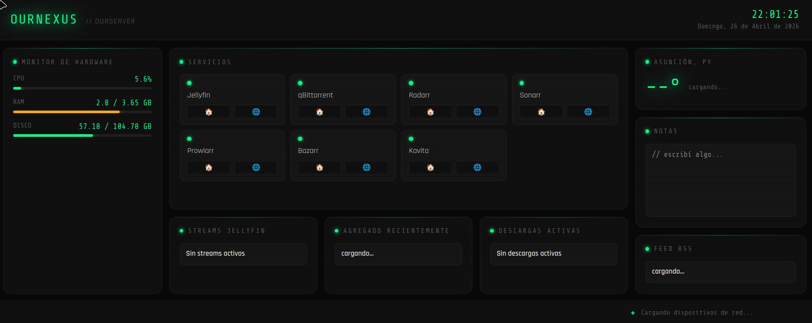

# OurNexus Dashboard

A personal homelab dashboard built from scratch to monitor and control my self-hosted server infrastructure. Accessible from any device via Tailscale VPN.



## Features

- **System Monitor** — Real-time CPU, RAM and disk usage with dynamic progress bars and color alerts
- **Active Downloads** — qBittorrent integration showing active torrents with progress bars and speeds
- **Service Bookmarks** — Quick access to all self-hosted services with local and Tailscale links
- **Clock** — Live date and time display
- **Notes** — Persistent markdown notepad saved locally
- *More widgets in progress: Jellyfin streams, Radarr/Sonarr recent content, weather, RSS feed, network devices*

## Stack

| Layer | Technology | Why |
|-------|-----------|-----|
| Backend | Python + FastAPI | Modern, fast, auto-generates API docs |
| Frontend | Vanilla HTML/CSS/JS | No framework overhead, full understanding of every line |
| System metrics | psutil | Native Python library for OS-level data |
| Download client | qBittorrent Web API | REST API integration |
| Remote access | Tailscale | Zero-config VPN, secure tunnel |
| Server OS | Debian 13 | Stable, minimal, runs on low-power hardware |

## Architecture
Browser (any device)
│
▼
FastAPI Backend (port 8000)
├── /api/sistema     → psutil reads CPU/RAM/disk
├── /api/descargas   → proxies qBittorrent Web API
└── /static/         → serves frontend files

The backend acts as a proxy between the frontend and internal services. This keeps API keys and service URLs server-side, never exposed to the browser.

## Hardware

Running on a repurposed laptop as a 24/7 home server:
- **CPU:** Intel Celeron N4000
- **RAM:** 4GB
- **OS:** Debian 13 minimal
- **Access:** Local network + Tailscale VPN

## Self-hosted Services

Jellyfin · qBittorrent · Radarr · Sonarr · Prowlarr · Bazarr · Kavita

## Setup

```bash
git clone https://github.com/e-fleitas/ournexus
cd ournexus
python3 -m venv venv
source venv/bin/activate
pip install -r requirements.txt
cp .env.example .env
# Edit .env with your credentials
uvicorn main:app --host 0.0.0.0 --port 8000
```

## Environment Variables

See `.env.example` for required variables.

---

*Built as a first real portfolio project — learning FastAPI, vanilla JS, Linux server administration, and API integration by building something I actually use every day.*